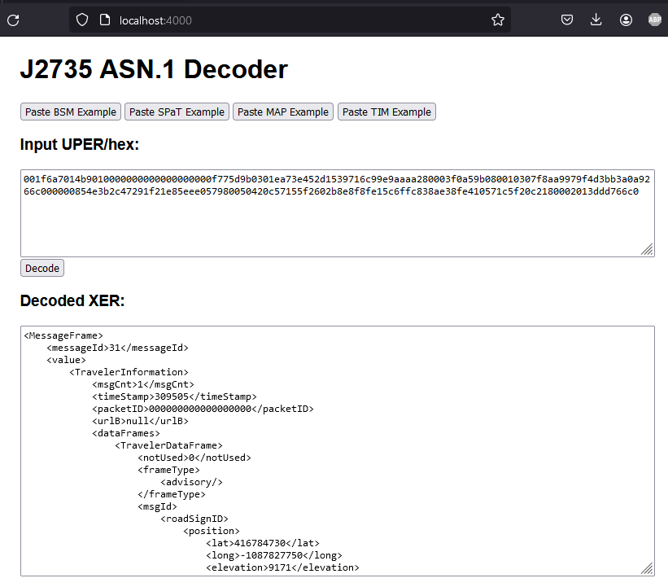

# asn1-codec-java

## Introduction

Demonstrates using the decode function of the native asn1_codec executable from a Java program. 

## How It Works

The Dockerfile builds a single image containing both the native and Java apps.  The Java app calls the native executable synchronously, as an OS process, passing the input as a file.  It does NOT use JNI, and Kafka is not required.  The native app does not run continuously but works similar to a command-line app with one process per invocation that returns the output and exits.

The only change to the asn1_codec native code needed to get this to work was a slight tweak to the `ASN1_Codec::filetest()' function to make it produce decoded output directly to stdout instead of only logging it.

## Prerequisites

* Docker

## Installation

Clone the repository including submodules:

```bash
git clone --recurse-submodules https://github.com/iyourshaw/asn1-codec-java.git
```

Build and run the Docker image:

```bash
cd asn1-codec-java
docker compose up --build -d
```

Open a browser and navigate to:

http://localhost:4000

## Usage

Click one of the buttons to load an example message, or paste UPER hex into the text area, then click "Decode".



## To Do

* Add a REST API.
* Add option to produce JSON output (JER and ODE JSON).
* Make the executable location configurable.
* Add an encode function.

## Known Issues/Limitations

* asn1_codec is only known to run on Alpine Linux 3.12.  It does not work on the latest Alpine (3.19 as of May 2024).


